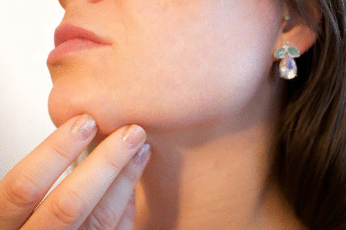

# Blemish-Removal
A GUI for removing blemishes
Blemish Remover

**Overview**

- This is a Python-based blemish removal tool that utilizes OpenCV for image processing. The script provides a GUI where users can click on blemishes in an image, and the algorithm will intelligently replace the blemished area with a seamless patch.

**Features**

- Removes blemishes using an automated neighbor selection process

- Uses OpenCV's seamless cloning for natural-looking patching

- Provides an interactive GUI to select blemish areas

- Supports undo functionality by pressing 'E'

**Requirements**

Ensure you have the following dependencies installed before running the script:

pip install opencv-python numpy matplotlib

**Usage**

1. Place the image you want to edit in the working directory and update ImagePath in the script.

2. Run the script:

      python blemish_remover.py

3. A GUI window will open displaying the image.

4. Click on blemishes to remove them.

5. Press 'E' to reset the image.

6. Press 'Esc' to exit.

**How It Works**

- Extracts neighboring patches around the blemish

- Compares gradient similarity between patches

- Selects the most suitable patch for seamless replacement

- Uses OpenCV's seamlessClone to blend the patch naturally

**Example**

- Before:

- After:

